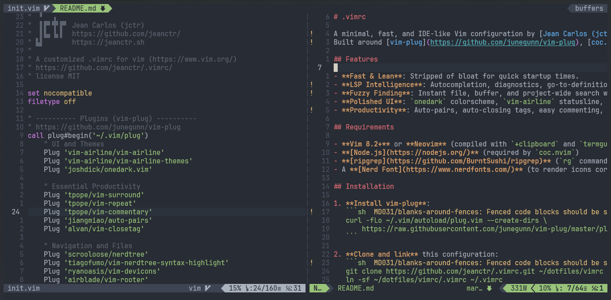

# .vimrc



A minimal, fast, and IDE-like Vim configuration by [Jean Carlos (jctr)](https://github.com/jeanctr).  
Built around [vim-plug](https://github.com/junegunn/vim-plug), [coc.nvim](https://github.com/neoclide/coc.nvim) for LSP intelligence, and [fzf](https://github.com/junegunn/fzf.vim) + `ripgrep` for blazing fast search.

## Features

- **Fast & Lean**: Stripped of bloat for quick startup times.
- **LSP Intelligence**: Autocompletion, diagnostics, go-to-definition, and renaming via `coc.nvim`.
- **Fuzzy Finding**: Instant file, buffer, and project-wide search with `fzf` and `ripgrep`.
- **Polished UI**: `onedark` colorscheme, `vim-airline` statusline, and `devicons`.
- **Productivity**: Auto-pairs, auto-closing tags, easy commenting, and Git hunk navigation (`vim-signify`).

## Requirements

- **Vim 8.2+** or **Neovim** (compiled with `+clipboard` and `termguicolors`)
- **[Node.js](https://nodejs.org/)** (required by `coc.nvim`)
- **[ripgrep](https://github.com/BurntSushi/ripgrep)** (`rg` command)
- A **[Nerd Font](https://www.nerdfonts.com/)** (to render icons correctly)

## Installation

1. **Install vim-plug**:
   ```sh
   curl -fLo ~/.vim/autoload/plug.vim --create-dirs \
       https://raw.githubusercontent.com/junegunn/vim-plug/master/plug.vim
   ```

2. **Clone and link** this configuration:
   ```sh
   git clone https://github.com/jeanctr/.vimrc.git ~/dotfiles/vimrc
   ln -sf ~/dotfiles/vimrc/.vimrc ~/.vimrc
   ```

3. **Install plugins** by opening Vim:
   ```vim
   :PlugInstall
   ```
   *(Note: `coc.nvim` may prompt you to install language extensions the first time you open a specific filetype).*

## Key Mappings

The `<Leader>` key is `<Space>`.

| Category    | Mapping             | Action                                      |
| :---------- | :------------------ | :------------------------------------------ |
| **Search**  | `<Leader> f`        | Fuzzy find files (`fzf`)                    |
|             | `<Leader> b`        | Fuzzy find buffers                          |
|             | `<Leader> g`        | Live grep project (`ripgrep`)               |
| **Nav**     | `<C-h/j/k/l>`       | Move between window splits                  |
|             | `<Leader> n`        | Toggle NERDTree file explorer               |
|             | `TAB` / `S-TAB`     | Next / Previous buffer                      |
| **LSP**     | `gd` / `gr`         | Go to definition / references               |
|             | `K`                 | Show documentation under cursor             |
|             | `<Leader> rn`       | Rename symbol                               |
| **Edit**    | `jk` or `kj`        | Exit insert mode                            |
|             | `<Leader> /`        | Toggle comment (normal/visual)              |
|             | `<C-s>` / `<C-q>`   | Save / Save & Quit                          |
| **Git**     | `<Leader> gj` / `gk`| Next / Previous Git hunk (`signify`)        |

## License

MIT

